#### Final Report 
#### Mengdi Lin (ml3567)
## BTree Index HowTos
### To Compile To An Exectuable
```bash
# set your PAGE_SIZE in BTreePage.h
BTREE_SIZE=<PAGE_SIZE in BTreepPage.h>
make -j 2
```
This should generate an executable with `test_<#>` where # corresponds to the page size 
### To Build A BTreeIndex With The Executable
```bash
./test_<#> -build <path_to_idx> <path_to_index> &> log
```
### To Perform Equality-Probe On Key With The Executable
```bash
#if we want to probe on a single key
./test_<#> -probe_key <key> <index_file_path> <binary_data_file_path>

#if we want to probe on a file of keys (file format must be the same as idx format)
./test_<#> -probe_file <data_file_path> <index_file_path> <binary_data_file_path>
```

### To Perform Range-Probe On Key With the Executable
```bash
#if we are searching for all keys x such that: x >= key
./test_<#> -range_probe_key_gt <key> <index_file_path> <binary_data_file_path>

#if we are searching for all keys x such that: key >= x
./test_<#> -range_probe_key_lt <key> <index_file_path> <binary_data_file_path>

#if we are searching for all keys x such that: start_key <= x <= end_key
./test_<#> -range_probe_key_endpts <start_key> <end_key> <index_file_path> <binary_data_file_path>
```
## BTreeIndex API Functions
### To Build Index
```c++
BTreeIndex btree;
//dataIdxFilePath is a string representing the path of data idx file
vector<DataEntry> entries = btree.parse_idx_file(dataIdxFilePath); 
//build the tree in memory
btree.build_tree(entries);
//flush it to index file. indexFilePath is a string representing the path to index file
btree.flush(indexFilePath);
```

### To Perform Equality Probe On A Key
```c++
BTreeIndex btree;
//key is uint64_t
//index_fd and data_bin_fd are file descriptors of index file and data.bin file
//result is a pair where the first item is a boolean indicating 
// whether key is found in index. second item is the rid of key, if key is found
auto result = btree.probe(key,index_fd, data_bin_fd);
```

### To Perform Range Probe On A Key
```c++
//if we are searching for all keys x such that: x >= key
//key is uint64_t
//index_fd and data_bin_fd are file descriptors of index file and data.bin file
//bin_file_size is the file size of data_bin_fd
auto result = btree.range_probe_gt(key, index_fd, data_bin_fd, bin_file_size);

//if we are searching for all keys x such that: key >= x
auto result = btree.range_probe_lt(key, index_fd, data_bin_fd);

//if we are searching for all keys x such that: start_key <= x <= end_key
auto result = btree.range_probe_endpts(start_key, end_key, index_fd, data_bin_fd, bin_file_size);
```
<div style="page-break-after: always;"></div>

## BTreeIndex Architecture
### BTree Build Process
`BTreeIndex` takes an `idx file`, passes it to `BTreeIndex::parse_idx_file` which parses the file and returns a `vector<DataEntry>`. `BTreeIndex::build_tree` takes the vector and builds a tree in memory. `BTreeIndex::flush` flushes the tree onto a file.

### BTree Probe Process
`BTreeIndex` takes `key` and `indexFile` file descriptor for an equality probe and passes them to `BTreeIndex::probe` which does a probe on the Btree and returns the `rid` found at the leaf node that corresponds to the `key`. Then, it calls `BTreeIndex::probe_bin` with `rid` as parameter to probe `data.bin` file to find the actual offset of the key in `data.bin`. Range probes follow similar design as equality probe.

## BTreeIndex Experiments
### Background
2 sets of experiments were performed with 2 data sets in /dev/shm/genome/probes (both 0/ and 1/). Btree indicies were built from the 2 data sets (0/ and 1/) in /dev/shm/genome/probes and probed using random min hashes provided in  /dev/shm/genome/probes. Codes for building and probing for btree indices are built with -O4 optimization turned on.

### Size of Btree Index 
#### running on data in /dev/shm/genome/probes/0
page size | btree index size
---: | ---:
1024 | 43.0 MB
128 | 54.43 MB
2048 | 42.33 MB
256 | 47.41 MB
4096 | 42.0 MB
512 | 44.4 MB

#### running on data in /dev/shm/genome/probes/1
page size | btree index size
---: | ---:
1024 | 44.12 MB
128 | 55.83 MB
2048 | 43.43 MB
256 | 48.64 MB
4096 | 43.09 MB
512 | 45.55 MB

### BTree Index Build Time

This is the total time the bulkloading algorithm takes to create a btree index. Note that not all entries in data.idx are in the leaf nodes of the btree index. Instead, btree index only stores keys whose rids are every 4K apart in its leaf. Thus, btree index size is significantly smaller than hash index. 

#### running on data in /dev/shm/genome/probes/0
page size | build time (microseconds)
---: | ---:
1024 | 288276.0
128 | 674109.0
2048 | 262092.0
256 | 454288.0
4096 | 248702.0
512 | 346141.0

#### running on data in /dev/shm/genome/probes/1
page size | build time (microseconds)
---: | ---:
1024 | 294377.0
128 | 739542.0
2048 | 291138.0
256 | 463576.0
4096 | 261638.0
512 | 355268.0


### Performance of Btree Index Probe On Single Key

To measure the performance of a equality probe on a single key, I ran 581223607 random probes using the probe file provided in /dev/shm/genome/probes/0 and then took the average of the total time the index had taken to perform 581223607 random probes.

#### running on data in /dev/shm/genome/probes/0
page size | number of probes | avg microsecond per probe | successful probe | unsuccessful probe
---: | ---: | ---: | --: | --: |
1024 | 581223607 | 10 | 581018721 | 204886
128 | 581223607 | 13 | 581018721 | 204886
2048 | 581223607 | 10 | 581018721 | 204886
256 | 581223607 | 11 | 581018721 | 204886
4096 | 581223607 | 9 | 581018721 | 204886
512 | 581223607 | 10 | 581018721 | 204886

#### running on data in /dev/shm/genome/probes/1
page size | number of probes | avg microsecond per probe | successful probe | unsuccessful probe
---: | ---: | ---: | --: | --: |
1024 | 581223607 | 12 | 521002767 | 60220840
128 | 581223607 | 16 | 521002767 | 60220840
2048 | 581223607 | 11 | 521002767 | 60220840
256 | 581223607 | 12 | 521002767 | 60220840
4096 | 581223607 | 11 | 521002767 | 60220840
512 | 581223607 | 13 | 521002767 | 60220840

For a btree index, the larger the page size, the faster the probe since a large page size also indicates a shorter tree (fewer traversals to get to the leaf level). I noticed that btree indices take slightly longer when probing on the second data set which have a significantly higher number of unsuccessful probes. This can be explained by the implementation of the probe. For a btree probe, after it has reached the child node, the probe algorithm has to open data.bin and does a linear scan from a specific offset, looking for the key. If the key is not in data.bin, then the algorithm will keep reading until it has read 4096B. On the other hand, if the key is in data.bin, the algorithm will most likely terminate early before it finishes reading 4096B.


### Performance of BTree Index Range Probe

To measure the performance of range probe, I generated an input file with 10000 rows using `generate_range_sample_for_test` in `test.cpp`. Within each row, there is a start key, an end key, and the number of keys inbetween start and end keys (which is 1000). start keys are in random order (obtained from /dev/shm/genome/probes/0/probes.idx). When I ran the experiment, I probed on start and end keys until the end of input file.

#### running on data in /dev/shm/genome/probes/0
page size | number of probes | result size (number of keys, rids) | avg microsecond per probe
---: | ---: | ---: | --:
1024 | 10000 | 1000 | 64
128 | 10000 | 1000 | 70
2048 | 10000 | 1000 | 67
256 | 10000 | 1000 | 68
4096 | 10000 | 1000 | 67
512 | 10000 | 1000 | 69

#### running on data in /dev/shm/genome/probes/1
page size | number of probes | result size (number of keys, rids) | avg microsecond per probe
---: | ---: | ---: | --:
1024 | 10000 | 1000 | 64
128 | 10000 | 1000 | 72
2048 | 10000 | 1000 | 72
256 | 10000 | 1000 | 73
4096 | 10000 | 1000 | 70
512 | 10000 | 1000 | 71


## HashIndex HowTos
### To Compile To An Exectuable

```bash
# set your PAGE_SIZE in Page.h
HASH_SIZE=<PAGE_SIZE in Page.h>
make -j 2
```
This should generate an executable with `hash_test_<#>` where # corresponds to the page size 
### To Build A Hash Index With The Executable
```bash
./hash_test_<#> -build <path_to_idx> <path_to_index> <load_capacity> &> log
```
### To Perform Equality-Probe On Key With The Executable
```bash
#if we want to probe on a single key
./test_<#> -probe_key <key> <path_to_index> <load_capacity> &> log

#if we want to probe on a file of keys (file format must be the same as idx format)
./test_<#> -probe_file <path_to_idx> <path_to_index> <load_capacity> &> log
```
## HashIndex API Functions
### To Build Index
```c++
//load_capacity is a float in the range of (0,1]
HashIndex index(load_capacity);
//dataFilePath is the idx file path
//indexFileName is the path to output index file
index.build_index(dataFilePath, indexFileName);
```

### To Perform Equality Probe On A Key
```c++
//load_capacity is a float in the range of (0,1]
HashIndex index(load_capacity);
//index_fd is the file descriptor of index file
pair<bool,uint64_t> t_result = index.search(key, index_fd);
```

## HashIndex Architecture
### Hash Index Build Process
`HashIndex` takes `idx_path` and `indexFilePath`, and passes them to `HashIndex::build_index`. 

`build_index` has 5 steps.

	1. Parses idx file into a vector of DataEntry
	2. hash each key in DataEntry to number corresponding to a bucket
	3. partition keys based on their hash into a bucket
	4. merge empty primary buckets with overflow pages
	5. flush
<div style="page-break-after: always;"></div>

### Hash Index Probe Process

`HashIndex` takes `key` and `index_fd`, and passes them to `HashIndex::search`. 
`search` has 3 steps.

	1. read page from current offset in index
	2. if search key is larger than the largest key in current page, go to overflow page. Else, perform a binary search on the current page to get key.
	3. return rid
 
 
<div style="page-break-after: always;"></div>


## HashIndex Experiments

### Background
3 sets of experiments were performed with 3 data sets in /dev/shm/genome/probes. Hash indicies were built from the 3 data sets in /dev/shm/genome/probes and probed using random min hashes provided in  /dev/shm/genome/probes. Codes for building and probing for btree indices are built with -O4 optimization turned on. All experiments are ran on Ingatan.

### Hash Distribution Plots For Data In /dev/shm/genome/probes/0

Graphs below represent the distribution of keys per page in a hash index with a specific page size and load capacity. The distributions of hashed keys exhibit a normal curve, centering around `(PAGE_SIZE/16B)*load_capacity` (number of entries per page if entries are evenly distributed). The red curve is the distribution before `merge` algorithm tries to find empty hash buckets to merge with overflow pages. The green curve is the distribution after `merge` algorithm has been applied and empty primary buckets have been merged with overflow pages. `merge` algorithm does nothing for page sizes >= 1024B. For smaller page sizes, `merge` algorithm has collapsed the two ends of the distribution such that the ends are flatter and more points are concentrated around the median.

<div class="image123">
    <div style="display:inline-block;">
        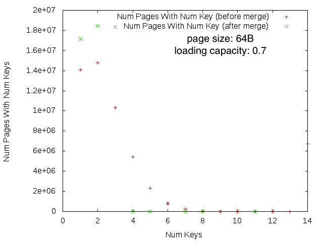
    </div>
    <div style="display:inline-block;">
        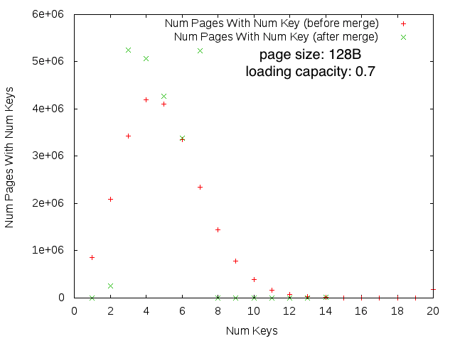
    </div>
    <div style="display:inline-block;">
         
    </div>
    <div style="display:inline-block;">
         
    </div>
    <div style="display:inline-block;">
         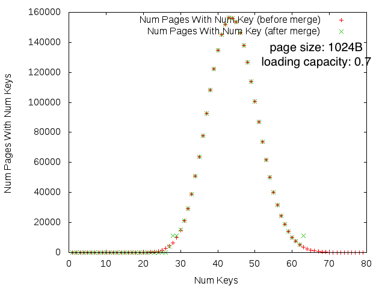
    </div>
     <div style="display:inline-block;">
         
    </div>
    <div style="display:inline-block;">
         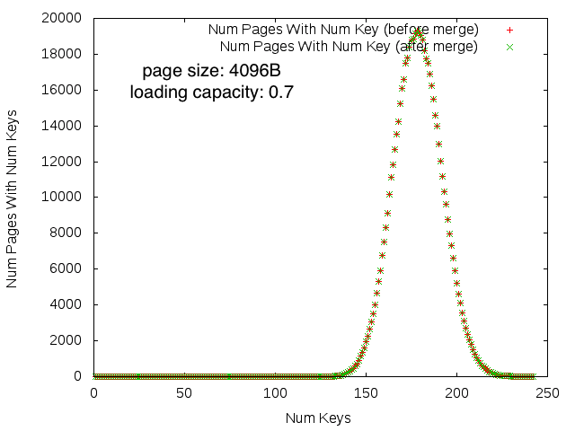
    </div>
    <div style="display:inline-block;">
        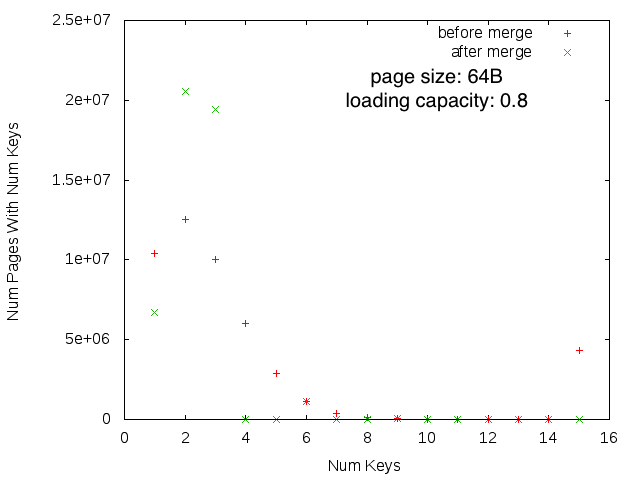
    </div>
    <div style="display:inline-block;">
        
    </div>
    <div style="display:inline-block;">
         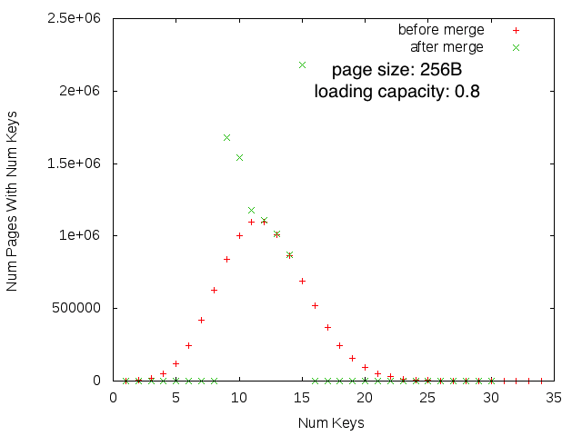
    </div>
    <div style="display:inline-block;">
         
    </div>
    <div style="display:inline-block;">
         
    </div>
     <div style="display:inline-block;">
         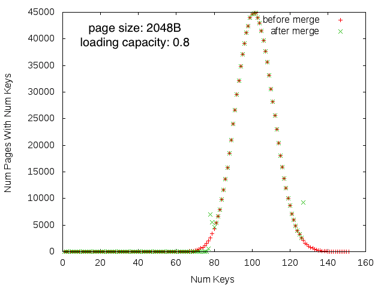
    </div>
    <div style="display:inline-block;">
         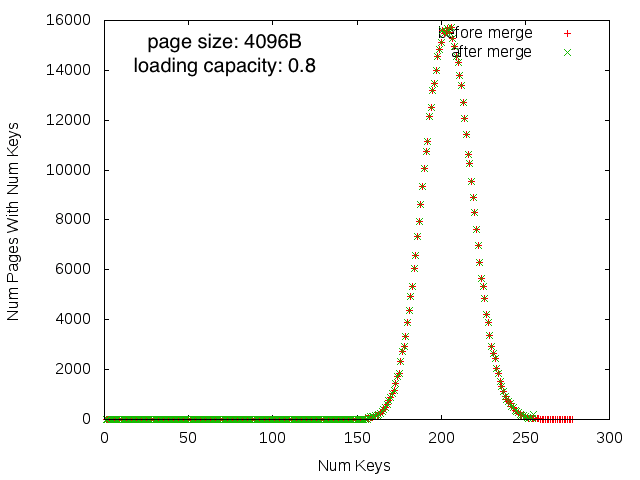
    </div>
</div>


### Codes For Generating Graphs
```bash
python clean_log.py <build log> <before merge log> <after merge log>
gnuplot
>set term png  
>set output "64_80.png"
>set xlabel "Num Keys"
>set ylabel "Num Pages With Num Keys"
>plot "64_80_before_merge" using 1:2 title "before merge", "64_80_after_merge" using 1:2 title "after merge"
>plot "4096_80_before_merge" using 1:2 title "Num Pages With Num Key (before merge)", "4096_70_hash_after_merge" using 1:2 title "Num Pages With Num Key (after merge)"
```

### Size of Hash Index 


In general, the larger the page size and the higher the load capacity, the smaller the index size. The smallest index comes from index with page size 4096B and 100% load capacity. Increasing the page size reduces the size of the index more significantly for page sizes <= 1048B whereas for indices with page size > 1048B, increasing the page size only reduces the index size with a small amount.

#### running on data in /dev/shm/genome/probes/0
page size (bytes) | load capacity | file size
---:|---:|---:
1024 | 100 | 1.75 GB
1024 | 70 | 2.49 GB
1024 | 80 | 2.17 GB
1024 | 90 | 1.93 GB
128 | 100 | 2.0 GB
128 | 70 | 2.8 GB
128 | 80 | 2.45 GB
128 | 90 | 2.19 GB
2048 | 100 | 1.74 GB
2048 | 70 | 2.47 GB
2048 | 80 | 2.16 GB
2048 | 90 | 1.92 GB
256 | 100 | 1.86 GB
256 | 70 | 2.61 GB
256 | 80 | 2.28 GB
256 | 90 | 2.03 GB
4096 | 100 | 1.73 GB
4096 | 70 | 2.46 GB
4096 | 80 | 2.15 GB
4096 | 90 | 1.91 GB
512 | 100 | 1.79 GB
512 | 70 | 2.53 GB
512 | 80 | 2.21 GB
512 | 90 | 1.96 GB
64 | 100 | 2.48 GB
64 | 70 | 3.33 GB
64 | 80 | 2.96 GB
64 | 90 | 2.69 GB

#### running on data in /dev/shm/genome/probes/1
page size (bytes) | load capacity | file size
---:|---:|---:
1024 | 100 | 1.79 GB
1024 | 70 | 2.55 GB
1024 | 80 | 2.23 GB
1024 | 90 | 1.98 GB
128 | 100 | 2.05 GB
128 | 70 | 2.87 GB
128 | 80 | 2.51 GB
128 | 90 | 2.24 GB
256 | 100 | 1.9 GB
256 | 70 | 2.67 GB
256 | 80 | 2.34 GB
256 | 90 | 2.08 GB
512 | 100 | 1.83 GB
512 | 70 | 2.59 GB
512 | 80 | 2.26 GB
512 | 90 | 2.01 GB
64 | 100 | 2.54 GB
64 | 70 | 3.41 GB
64 | 80 | 3.03 GB
64 | 90 | 2.75 GB

#### running on data in /dev/shm/genome/probes/2
page size (bytes) | load capacity | file size
---:|---:|---:
1024 | 100 | 1.8 GB
1024 | 70 | 2.55 GB
1024 | 80 | 2.23 GB
1024 | 90 | 1.98 GB
128 | 100 | 2.05 GB
128 | 70 | 2.87 GB
128 | 80 | 2.51 GB
128 | 90 | 2.24 GB
256 | 100 | 1.9 GB
256 | 70 | 2.67 GB
256 | 80 | 2.34 GB
256 | 90 | 2.08 GB
512 | 100 | 1.83 GB
512 | 70 | 2.59 GB
512 | 80 | 2.26 GB
512 | 90 | 2.01 GB


### Hash Index Build Time

Large page size and high load capacity correlates with a shorter index build time. Building a hash index is moderately faster than building a btree index as seen from the build times of both hash and btree indices.

#### running on data in /dev/shm/genome/probes/0
page size | load capacity | build time (ms)
---:|---:|---:
1024 | 100 | 171389.135136
1024 | 70 | 223710.145579
1024 | 80 | 168161.630477
1024 | 90 | 166776.003406
128 | 100 | 234563.707079
128 | 70 | 289828.123695
128 | 80 | 236725.524979
128 | 90 | 235922.372648
2048 | 100 | 167470.062586
2048 | 70 | 202760.919218
2048 | 80 | 176125.10483
2048 | 90 | 162039.708698
256 | 100 | 200483.511471
256 | 70 | 221573.838233
256 | 80 | 207636.302969
256 | 90 | 203757.940441
4096 | 100 | 160234.395502
4096 | 70 | 164579.079287
4096 | 80 | 158014.133829
4096 | 90 | 160892.606469
512 | 100 | 181270.80125
512 | 70 | 191675.995715
512 | 80 | 179316.751932
512 | 90 | 180707.174209
64 | 70 | 347764.071148
64 | 80 | 315848.490653
64 | 90 | 322349.01136

#### running on data in /dev/shm/genome/probes/1
page size | load capacity | build time (ms)
---:|---:|---:
1024 | 100 | 169212.891371
1024 | 70 | 170016.062537
1024 | 80 | 162829.003763
1024 | 90 | 177309.245472
128 | 100 | 222264.495195
128 | 70 | 247171.878918
128 | 80 | 232301.465799
128 | 90 | 238997.341209
256 | 100 | 192225.984272
256 | 70 | 202073.177647
256 | 80 | 208734.958637
256 | 90 | 207179.320846
512 | 100 | 179182.509888
512 | 70 | 188705.391672
512 | 80 | 178942.686694
512 | 90 | 183014.701338
64 | 100 | 308592.543915
64 | 70 | 251495.116857
64 | 80 | 249108.102207
64 | 90 | 267156.510625

#### running on data in /dev/shm/genome/probes/2
page size | load capacity | build time (ms)
---:|---:|---:|---:
1024 | 100 | 166695.284624
1024 | 70 | 171969.419878
1024 | 80 | 171068.201793
1024 | 90 | 165339.598203
128 | 100 | 217734.888551
128 | 70 | 224562.107108
128 | 80 | 216592.967218
128 | 90 | 213045.054758
256 | 100 | 201341.027593
256 | 70 | 194945.271324
256 | 80 | 214449.548223
256 | 90 | 191886.920873
512 | 100 | 178424.062664
512 | 70 | 182022.679635
512 | 80 | 180544.243822
512 | 90 | 174793.360486

### Performance of Hash Index Probe
For the first data set `/0/`, hash index with page size of 512B and load capacity of 70 yields the fastest average probe time. hash index with page size of 256B and load capacity of 90 yields the second fastest average probe time. Hash index with page size of 512B and load capacity of 100 yields the third fastest average probe time. 

For the second data set `/1/`, hash index with page size of 512B and load capacity of 70 yields the fastest average probe time. Hash index with page size of 1024B and load capacity of 70 yields the second fastest average probe time. Hash index with page size of 512B and load capacity of 80 yields the third fastest average probe time. 

For the third data set `/2/`, hash index with page size of 128B and load capacity of 70 yields the fastest average probe time. Hash index with page size of 256B and load capacity of 100 yields the second fastest average probe time. Hash index with page size of 256B and load capacity of 80 yields the third fastest average probe time. 

Overall, page sizes larger than 1048B and page sizes smaller than 128B do not perform as well as pages that are within [128B, 1048B]. There is no one page size that performs consistently the best across probes on three data sets. However, hash index with page size of 512B and load capacity of 70 performs above average in comparison to other hash indices. Even though the second data set have a significantly higher number of unsuccessful probes (probing on key not found in index), there is no significantly change in the speed of probe. Thus, hash indices perform equally well for a successful and an unsuccessful probe. 


#### running on data in /dev/shm/genome/probes/0
page size | load capacity | total probes | average probe time (ns) | total probe time (s) | num of successful probe | num of unsuccessful probe
---:|---:|---:|---:|---:|---:|---:|
1024 | 100 | 581223607 | 1857 | 1079.49 | 581018721 | 204886
1024 | 70 | 581223607 | 1316 | 765.09 | 581018721 | 204886
1024 | 80 | 581223607 | 2113 | 1228.44 | 581018721 | 204886
1024 | 90 | 581223607 | 1908 | 110.92 | 581018721 | 204886
128 | 70 | 581223607 | 1527 | 888.065 | 581018721 | 204886
128 | 80 | 581223607 | 1535 | 892.44 | 581018721 | 204886
128 | 90 | 581223607 | 1623 | 943.55 | 581018721 | 204886
2048 | 100 | 581223607 | 2564 | 1490.75 | 581018721 | 204886
2048 | 70 | 581223607 | 2361 | 1372.65 | 581018721 | 204886
2048 | 80 | 581223607 | 2398 | 1394.05 | 581018721 | 204886
2048 | 90 | 581223607 | 2026 | 1177.88 | 581018721 | 204886
256 | 100 | 581223607 | 1643 | 955.32 | 581018721 | 204886
256 | 70 | 581223607 | 1622 | 942.89 | 581018721 | 204886
256 | 80 | 581223607 | 1403 | 815.49 | 581018721 | 204886
256 | 90 | 581223607 | 1187 | 690.28 | 581018721 | 204886
4096 | 100 | 581223607 | 1763 | 1025.03 | 581018721 | 204886
4096 | 70 | 581223607 | 2551 | 1482.82 | 581018721 | 204886
4096 | 80 | 581223607 | 2969 | 1726.14 | 581018721 | 204886
4096 | 90 | 581223607 | 2876 | 1671.77 | 581018721 | 204886
512 | 100 | 581223607 | 1270 | 738.58 | 581018721 | 204886
512 | 70 | 581223607 | 1184 | 688.63 | 581018721 | 204886
512 | 80 | 581223607 | 1532 | 890.55 | 581018721 | 204886
512 | 90 | 581223607 | 1904 | 110.68 | 581018721 | 204886
64 | 100 | 581223607 | 1678 | 975.50 | 581018721 | 204886
64 | 70 | 581223607 | 1458 | 847.86 | 581018721 | 204886
64 | 80 | 581223607 | 1334 | 775.88 | 581018721 | 204886
64 | 90 | 581223607 | 1615 | 938.93 | 581018721 | 204886

#### running on data in /dev/shm/genome/probes/1
page size | load capacity | total probes | average probe time (ns) | total probe time (s) | num of successful probe | num of unsuccessful probe
---:|---:|---:|---:|---:|--:|--:|
1024 | 100 | 581223607 | 1970 | 1145.42 | 521002767 | 60220840
1024 | 70 | 581223607 | 1285 | 746.95 | 521002767 | 60220840
1024 | 80 | 581223607 | 1939 | 1127.19 | 521002767 | 60220840
1024 | 90 | 581223607 | 1954 | 1135.75 | 521002767 | 60220840
128 | 100 | 581223607 | 1599 | 929.91 | 521002767 | 60220840
128 | 70 | 581223607 | 1479 | 859.97 | 521002767 | 60220840
128 | 80 | 581223607 | 1574 | 915.05 | 521002767 | 60220840
128 | 90 | 581223607 | 1562 | 908.21 | 521002767 | 60220840
256 | 100 | 581223607 | 1679 | 976.35 | 521002767 | 60220840
256 | 90 | 581223607 | 1464 | 851.38 | 521002767 | 60220840
512 | 100 | 581223607 | 1445 | 840.24 | 521002767 | 60220840
512 | 70 | 581223607 | 1199 | 697.16 | 521002767 | 60220840
512 | 80 | 581223607 | 1303 | 757.69 | 521002767 | 60220840
512 | 90 | 581223607 | 1855 | 1078.25 | 521002767 | 60220840
64 | 100 | 581223607 | 1327 | 771.85 | 521002767 | 60220840
64 | 70 | 581223607 | 1634 | 950.28 | 521002767 | 60220840
64 | 80 | 581223607 | 1375 | 799.31 | 521002767 | 60220840
64 | 90 | 581223607 | 1568 | 911.64 | 521002767 | 60220840

#### running on data in /dev/shm/genome/probes/2
page size | load capacity | total probes | average probe time (ns) | total probe time (s) | num of successful probe | num of unsuccessful probe
---:|---:|---:|---:|---:|--:|--:|
1024 | 100 | 581223607 | 2250 | 1308.24 | 581078110 | 145497
1024 | 70 | 581223607 | 2068 | 1202.24 | 581078110 | 145497
1024 | 80 | 581223607 | 2165 | 1258.79 | 581078110 | 145497
1024 | 90 | 581223607 | 2043 | 1187.81 | 581078110 | 145497
128 | 100 | 581223607 | 1584 | 921.09 | 581078110 | 145497
128 | 70 | 581223607 | 1065 | 619.51 | 581078110 | 145497
128 | 80 | 581223607 | 1529 | 888.95 | 581078110 | 145497
128 | 90 | 581223607 | 1639 | 953.08 | 581078110 | 145497
256 | 100 | 581223607 | 1124 | 653.62 | 581078110 | 145497
256 | 70 | 581223607 | 1473 | 856.30 | 581078110 | 145497
256 | 80 | 581223607 | 1246 | 724.42 | 581078110 | 145497
256 | 90 | 581223607 | 1502 | 873.53 | 581078110 | 145497
512 | 100 | 581223607 | 1878 | 1091.65 | 581078110 | 145497
512 | 70 | 581223607 | 1924 | 1118.85 | 581078110 | 145497
512 | 80 | 581223607 | 2047 | 1190.21 | 581078110 | 145497
512 | 90 | 581223607 | 1929 | 1121.36 | 581078110 | 145497


## Ingatan Stats
* Processor model name: Intel(R) Xeon(R) CPU E5-4620 0 @ 2.20GHz
* Architecture:          x86_64
* CPU(s):                64
* L1d cache:             32K
* L1i cache:             32K
* L2 cache:              256K
* L3 cache:              16384K
* MemTotal:       528359424 kB

## Conclusion

Btree indices (~4MB), on average, are 500 times smaller than hash indices (~2GB) because not all entries in data.idx are in the leaf nodes of the btree index. Instead, btree index only stores keys whose rids are every 4K apart in its leaf. On the other hand, hash indices must store all (key, rid) pairs provided in data.idx file. On the other hand, a btree index probe (~10ms) is 10 times slower than a hash index probe (~1ms). Probing a key that is not in the index is shown to be slower when doing a btree probe, whereas the existence of key in the index does not impact the probe speed in the hash index.